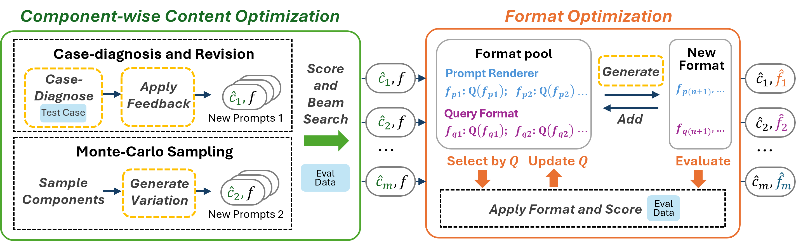
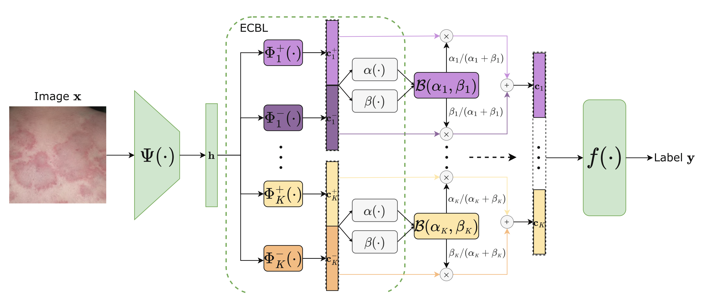
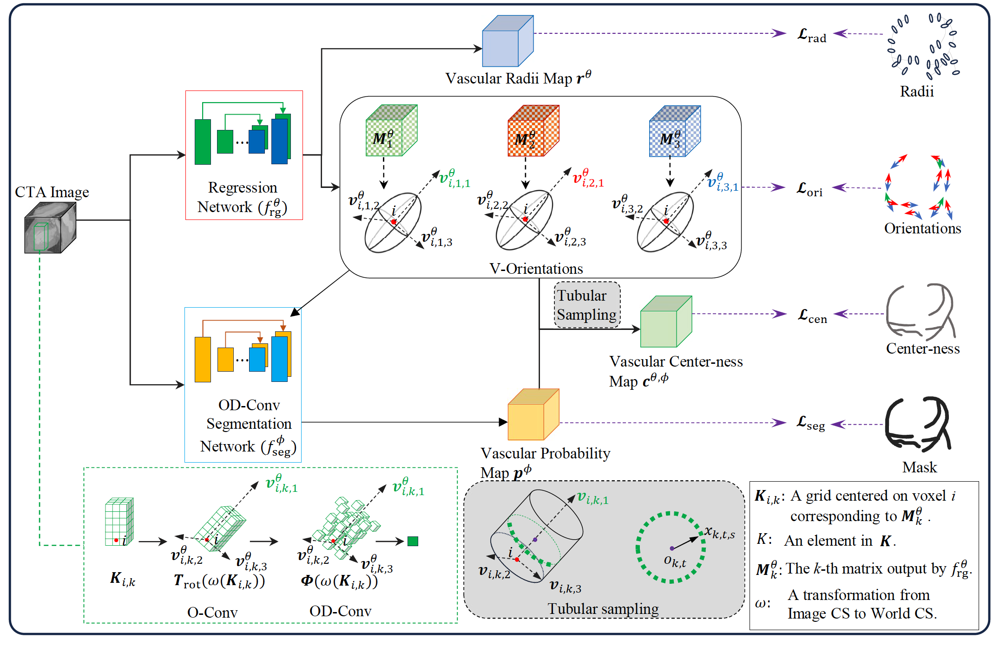

<!-- Coming soon... -->
\# denote equal contribution.

## Preprint

 
   
* <b>Beyond Prompt Content: Enhancing LLM Performance via Content-Format Integrated Prompt Optimization</b>  
  <b>Yuanye Liu#</b>, Jiahang Xu#, Li Lyna Zhang, Qi Chen, Xuan Feng, Yang Chen, Zhongxin Guo, Yuqing Yang, Cheng Peng  
  [[Arxiv]](https://arxiv.org/abs/2502.04295) [[Code]](https://github.com/HenryLau7/CFPO)
   

## Journal
 
   
* <b>MERIT: Multi-view Evidential learning for Reliable and Interpretable liver fibrosis sTaging</b> 
  <b>Yuanye Liu#</b>, Zheyao Gao#, Nannan Shi#, Fuping Wu, Yuxin Shi, Qingchao Chen, Xiahai Zhuang  
  <b>Medical Image Analysis</b> 
  [[MedIA]](https://www.sciencedirect.com/science/article/pii/S1361841525000556) [[Arxiv]](https://arxiv.org/abs/2405.02918) [[Code]](https://github.com/HenryLau7/MERIT)
   

## Conferences
 
   
* <b>A Reliable and Interpretable Framework of Multi-view Learning for Liver Fibrosis Staging</b> 
 Zheyao Gao#, <b>Yuanye Liu#</b>, Fuping Wu, Nannan Shi, Yuxin Shi, Xiahai Zhuang  
  <b>MICCAI2023 (Oral presentation, Nomination for best paper and young scientist award )</b>.
  [[MICCAI]](https://link.springer.com/chapter/10.1007/978-3-031-43904-9_18) [[Code]](https://github.com/HenryLau7/MERIT)
   

   
* <b>Evidential Concept Embedding Models: Towards Reliable Concept Explanations for Skin Disease Diagnosis</b> 
 Yibo Gao, Zheyao Gao , Xin Gao , <b>Yuanye Liu</b>, Bomin Wang , and Xiahai Zhuang  
  <b>MICCAI2024</b>.
  [[MICCAI]](https://link.springer.com/content/pdf/10.1007/978-3-031-72117-5_29)[[Arxiv]](https://arxiv.org/pdf/2406.19130)
   

   
* <b>Deep Combined Computing of Vascular Images with Tubular Shape-Guided Convolution
</b> 
Zilong Wang, Xinyang Ge, Xiaorong Chen, Lei Li, Wangbin Ding, <b>Yuanye Liu</b>, Fuping Wu, and Dengqiang Jia  
  <b>MICCAI2024 Workshop</b>.
  [[MICCAI]](https://link.springer.com/chapter/10.1007/978-3-031-75291-9_4)
   

 
 
