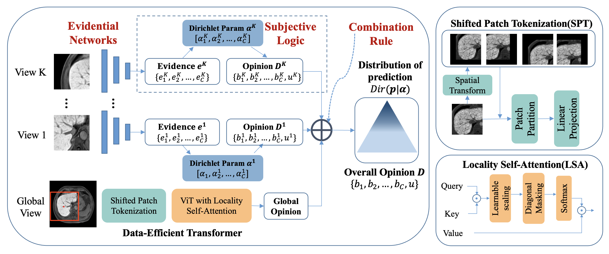

<!-- Coming soon... -->

## Conferences
  
  <b>A Reliable and Interpretable Framework of Multi-view Learning for Liver Fibrosis Staging</b> 
  Zheyao Gao*, <b>Yuanye Liu*</b>, Fuping Wu, Nannan Shi, Yuxin Shi, Xiahai Zhuang  
  <b>MICCAI2023 (Early Accept, Top 14% in 2253 submissions)</b>. 

 
 
