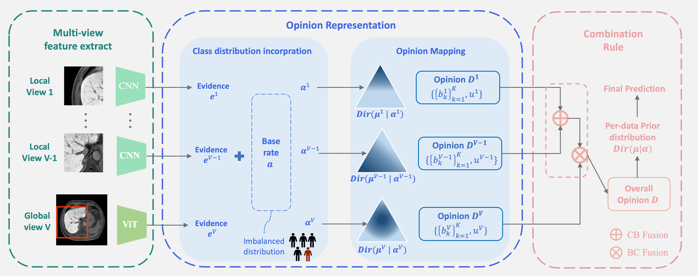

<!-- Coming soon... -->

## Preprint
 
   
* <b>MERIT: Multi-view Evidential learning for Reliable and Interpretable liver fibrosis sTaging</b> 
  <b>Yuanye Liu</b>\*, Zheyao Gao\*, Nannan Shi\*, Fuping Wu, Yuxin Shi, Qingchao Chen, Xiahai Zhuang  
  <b>[Arxiv](https://arxiv.org/abs/2405.02918)</b>. 
   

## Conferences
 
   
* <b>A Reliable and Interpretable Framework of Multi-view Learning for Liver Fibrosis Staging</b> 
 Zheyao Gao*, <b>Yuanye Liu*</b>, Fuping Wu, Nannan Shi, Yuxin Shi, Xiahai Zhuang  
  <b>MICCAI2023 (Oral presentation, Nomination for best paper and young scientist award )</b>.
   

 
 
